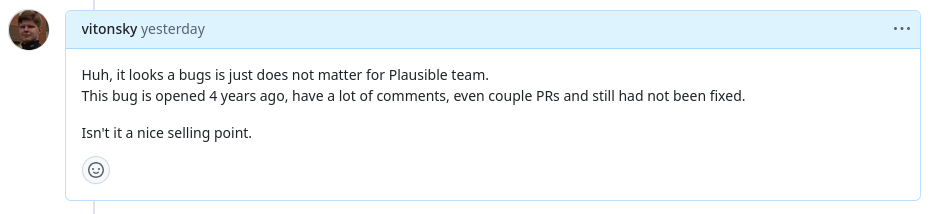

[](https://www.npmjs.com/package/plausible-client) 

Plausible client to collect analytics in browser with no hassle.

# Why?

There are official [`plausible-tracker` package](https://github.com/plausible/plausible-tracker), it have quite few code, but have a lot of bugs like
- "enableAutoOutboundTracking breaks target="_blank" and probably noopener security" [#12](https://github.com/plausible/plausible-tracker/issues/12)
- uses XHR API that loses analytics on static sites with no SPA approach (like [Astro](https://astro.build/) does) [#16](https://github.com/plausible/plausible-tracker/issues/16)
- uses callbacks, that will not be called on localhost, that force users write code that works different locally and on production



Current package is lightweight too, but written and maintained by those who use a plausible analytics on production. See [dogfooding](https://en.wikipedia.org/wiki/Eating_your_own_dog_food).

# Usage

Install package with `npm i plausible-client`

Create instance and play

```ts
import { Plausible } from 'plausible-client';

const plausible = new Plausible({
	apiHost: 'https://plausible.io',
	domain: 'example.org',
});

plausible.sendEvent('test', {
	props: {
		foo: 1,
		bar: 'string',
	}
});
```

## Automatically track pageviews

```ts
import { Plausible, enableAutoPageviews } from 'plausible-client';

const plausible = new Plausible({
	apiHost: 'https://plausible.io',
	domain: 'example.org',
});

// Function returns cleanup callback and starts track pageviews
enableAutoPageviews(plausible);
```

# Development

`plausible-client` is an truth open source project, so you are welcome on [project github repository](https://github.com/vitonsky/plausible-client/) to contribute a code, [make issues](https://github.com/vitonsky/plausible-client/issues/new/choose) with feature requests and bug reports.

You may contribute to a project if you tell about `plausible-client` to your friends.